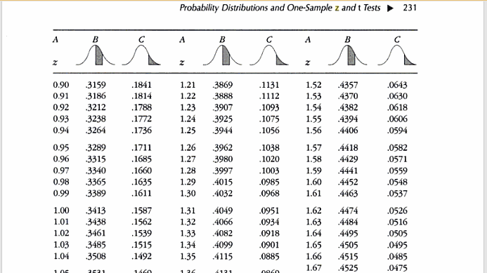
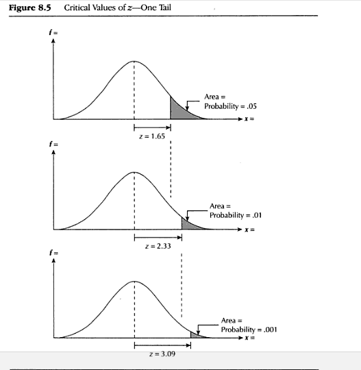
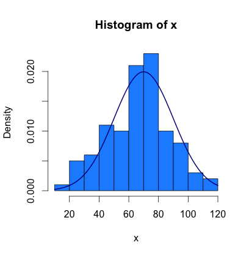

## Chapter 8 Slides

## Probability Distributions and One-Sample $z$ and $t$ Tests

### Date: October 6, 2014

### Author, Sherri Ann Verdugo, M.S.

### Instructor, CSUF Sociology Department

--- .class #title
## Administration

* Attendance
* Always read instructions for assignments:
    * either in the forum, the initial posting, or the document itself
* Last Week: 
    * Chapter 7 Statistical Inference
* This Week: Inference at a Deeper Level
  * Chapter 8 Probability, z and t tests
  * Chapter 9 Two Sample t-tests
* Today: Chapter 8 Probability Distributions
* Upcoming Items
    * Homework 2 released Monday 10/6/14
    * Exam 2 10/22
    * Writing Draft 10/29

Feedback Packets (previous graded assignments and homework)

--- .class #admin

## Prologue & Introduction

This chapter is a continuation of chapter 7. This chapter is focused on what we are actually doing when we perform a $z$ test. Sometimes understanding the underlying process, you gain more insight into the task at hand. Case in point, taking care of a pool. You don't need to understand the chemistry behind the chlorine and chemical test kits. If you know it though, you have a better understanding of achieving a pool that has appropriate levels of chlorine. Let's dive into statistics a little bit further.

--- .class #prologue

## Key Concepts

* Normal Distribution
    * A family of frequency distributions that, when graphed often resemble bells.
* Standard Score
    * A score universally designated by the letter $z$, in which that score is expressed in standard deviation units from the mean.
* One-sample z Test
    * A test of significance that can be performed when we know the population's standard deviation as well as its mean.
* Sampling Distribution of the Sample Means
    * The frequency distribution that would be obtained from calculating the means of all theoretically possible samples of a designated size that could be drawn from a given population.

--- .class #keyconcepts

## Key Concepts, continued

* Central Limit Theorem
    * If repeated random samples of size n are drawn from a population that is normally distributed along some variable x, having a mean, $\mu$ and a standard deviation $\sigma$, the the sampling distribution of all theoretically possible sample means will be a normal distribution of all theoretically possible sample means will be a normal distribution having a mean $\mu$ and a standard deviation of $\frac{\sigma}{\sqrt{n}}$.
* Standard Error a.k.a. "Standard Error of the Mean"
    * The standard deviation of the sampling distribution, designated with the symbol $\sigma_{\bar{x}}$
* Normality Assumption
    * The assumption that the population being studied is normally distributed along variable x.
* Law of Large Numbers
    * A law that states that if the size of the sample, $n$, is sufficiently large (no less than 30, preferably no less than 50), then the Central Limit Theorem will apply even if the population is not normally distributed along, variable x. 
    
**Note: this requires further testing in the real world...for this class, we will use that assumption without testing. However, we may find ourselves in the real world testing the normality of a distribution along a variable x.**

--- .class #keyconcepts2

## Key Concepts, continued

* "sigma-hat" $\hat{\sigma}$
    * An estimate of sigma. Note: if you see anything with a hat on it...we are using an ESTIMATE.
* t Test
    * A test of significance similar to the z test but used when the population's standard deviation is unknown.
* Degrees of Freedom
    * A number that is generated to make use of a table of critical values. It is the number of values in the final calculation of a statistic that are free to vary. 
    

--- .class #keyconcepts3

## Key Concepts, continued

* z Test for Proportions
    * A z test designed to test whether the difference between proportions in a sample reflects the difference in the population.
* Interval Estimation
    * An interval of scores that is established, within which a population's mean (or another parameter is likely to fall, when that parameter is being estimated from sample data).
* Confidence Intervals for Means and Proportions
    * An estimated interval within which we are "confident" -- based on sampling theory -- that the parameter we are trying to estimate will fall.
    

--- .class #keyconcepts 4

## Key Concepts, continued

* Conditional Probability 
    * The probability of outcome $A$ occurring given that the outcome for $B$ has already occurred.
* Addition Rules of Probability
    * A rule by which when outcomes are **MUTUALLY EXCLUSIVE**, the probability of either outcome occurring is the sum of the probabilities of each outcome occurring.
* Multiplication Rules of Probability
    * A rule that is used to find $P(A and D)$.
* Permutations
    * The total possible samples that can be drawn from a population where the order of selection is a factor.
* Combinations
    * The total possible samples when the order of selection is ignored.

--- .class #keyconcepts5

## Chapter 8 Outline

* Introduction
* Normal Distributions
* Proportion of Area Under Standard Normal Curves
* One Sample $z$ Test for Statistical Significance
* Central Limit Theorem
* CLT and Hypothesis Testing Review
* Normality Assumption
* One Sample t-test for Statistical Inference
* Degrees of Freedom
* The t Table
* Alternative t Formula
* A z Test for Proportions
* Interval Estimation
* Confidence Intervals for Proportions
* A FEW MORE WORDS ON PROBABILITY
* Permutations and Combinations
* Conclusion
* Major Equations for Chapter 8

--- .class #concepts

## Introduction

* Chapter 7 introduced the test of significance under the lens of the $z$ score to demonstrate the procedure. Recall, that $z = \frac{\bar{x} - \mu}{\frac{\sigma}{\sqrt{n}}}$. 
* Characteristics of $z$
    * Frequency distribution: normal distribution
    * Applied to a specific normal curve: sampling distribution of the sample means.
* What are we doing with $z$
    * Taking the given sample statistic and population parameters
    * Locating them on the sampling distribution of the sample means
* All significance tests follow the same method. They just use different sampling distributions.
* The test you use must be appropriate for the distribution!

--- .class #introrecap

## Normal Distributions

### What is normal?

* Normal is a family of frequency distributions that, when graphed often resemble bells.
* Normal = Gaussian

### Family of gaussian distrubutions, by increasing st. deviation 1 to 4 

--- .class #NormalDistr

## Normal Distributions, continued

### Major characteristics

* uni modal
* symmetric
* asymptotic to the x-axis

### Reason for the term "normal"

* certain characteristics follow a normal distribution
    * height
    * weight
    * intelligence
    
* Not everything in nature is normally distributed.
* Other distributions are not "abnormal"...they are just "different distributions"

--- .class #NormalDistr2

## Normal Distributions: Standard Scores

* Standard Score
    * score that is universally designated by the letter $z$, in which that score is expressed in standard deviation units from the mean.
    
This time our equation is this: $\frac{x-\mu}{\sigma}$ and the table for proportions of area under the standard normal curve is 

### How do we read this table?

--- .class #NormalDistr3

## Reading the table for proportions of area under the standard normal curve 

* On the previous slide, we saw a portion of the table for proportions of area under the standard normal curve. 
* Steps to read the table
    * Three columns of A: these are the values of $z$ calculated from the equation
    * Three columns of B: these are the area under the curve from the mean *out to the specified value of z*
    * Three columns of C: these are the area in the tail *from* the z score (the tails)
* Tip: the area from column B and column C add to .50 or 50%
    * Example: z = 0.17 with Column B = 0.0675 and Column C = 0.4325 so, 
    * $0.0675 + 0.4325 = 0.5000$ or 50%
* Tip: as z get larger
    * Column B gets larger
    * Column C gets SMALLER

--- .class #NormalDistr4

## Z Score example with the table pages 227 to 230

### Sandy's IQ

Question: What proportion of people are above and below Sandy's IQ.

* Sandy score = 115 (observed)
* Mean = 100 (expected)
* Standard Deviation is 10

### So how do we handle this?

--- .class #NormalDistr5

## Sandy's z Score

The z equation is: $\frac{x - \mu}{\sigma}$

* Sandy's z score is: $\frac{115 - 100}{10}=\frac{15}{10}=1.5$

### From the z table in the book:

* Percentage of people below Sandy
    * IQs between 100 and 114 for $z=1.5$ (column B) = .4332
    * IQs between 0 and 100: = .5000 (50 percent of the people are below the population mean or expected mean)
    * Add these two together: $.4332 + .500 = .9332$, which is the proportion of people with IQs below Sandy! Pretty Smart, eh? Sandy is above the mean (that is why the z score is positive).
    
### The proportion of people with IQs below Sandy is .9332

--- .class #NormalDistr6

## What about when z is negative? Pg. 229

What if George has a score of 80 on the IQ? This is not a problem because we know z scores can be positive (above the mean) and negative (below the mean).

* George's z score is: $\frac{80 - 100}{10}=\frac{-20}{10}=-2.0$
* At first, you might be confused...but remember that the normal curve is symmetrical. 
    * Meaning what happens on one side of the mean will happen on the other side of the mean...you can use z = 2.00 on page 232 of the textbook.
    * Column B is .4772
    * **Column C is .0228** the proportion of people with IQs below George
* We are still not finished with the proportion of people **Above** George.
    * Recall that .5000 are above the mean (properties of the st. normal curve)...and we need the proportion from George's score to the mean.
    * Therefore $.4772 + 0.500 = 0.9772$

### Nearly 98% of all IQ scores fall above George's score.

--- .class #NormalDistr7

## One Sample z Test for Statistical Significance: One Tail

### Chapter 7 Equation for z 

* Used for the following frequency distribution:
    * Sampling distribution of sample means
* Equation: $z = \frac{\bar{x}-\mu}{\frac{\sigma}{sqrt{n}}}$
* One Tail Critical Values of z
    * in this case we are looking at positive values (above the mean)
    * this applies to the negative values (below the mean)

* Sampling Distribution of Sample Means: frequency distribution that would be obtained from calculating the means of all theoretically possible sample of a designated size that could be drawn from a population.

--- .class #OneSampleZ1

## One Sample z Test for Statistical Significance: Two Tail

* Used for the following frequency distribution:
    * Sampling distribution of sample means $z = \frac{\bar{x}-\mu}{\frac{\sigma}{sqrt{n}}}$
* Two Tail Critical Values of z

* Sampling Distribution of Sample Means: frequency distribution that would be obtained from calculating the means of all theoretically possible sample of a designated size that could be drawn from a population.

--- .class #OneSampleZ2

## Working out the sampling distribution of the mean

* Scores range from: 1 to 5 .... (i.e. 1,2,3,4,5)
* Sample size, $n = 3$
* To find the different combinations of 10 samples using n=3

test     |x1 = |x2 =   |x3 =   |x4 =   |x5 = |x6 =   |x7 = |x8 =   |x9 =   |x10 = 
---------|-----|-------|-------|-------|-----|-------|-----|-------|-------|------
1        | 5   | 5     | 5     | 5     | 5   | 5     | 4   | 4     | 4     | 3
2        | 4   | 4     | 4     | 3     | 3   | 2     | 3   | 3     | 3     | 2
3        | 3   | 2     | 1     | 2     | 1   | 1     | 2   | 1     | 1     | 1
$\Sigma$ |*12* | *11*  | *10*  | *10*  | *9* | *8*   | *9* | *8*   | *8*   | *6*
$\bar{x}$|**4**|**3.7**|**3.3**|**3.3**|**3**|**2.7**|**3**|**2.7**|**2.7**|**2** 

* $\bar{x}=\frac{\sigma x}{3}$

$\bar{x}$ Values and Frequencies

$\bar{x}$| 4.0 | 3.7 | 3.3 | 3.0 | 2.7 | 2.3 | 2.0
---------|-----|-----|-----|-----|-----|-----|----
$f$      | 1   | 1   | 2   | 2   | 2   | 1   | 1

* Formal Reason behind this: *Central Limit Theorem* & the *Law of Large Numbers*

--- .class #OneSampleExample

## The FAMOUS & FABULOUS Central Limit Theorem (CLT)

**CLT**:  If repeated random samples of size n are drawn from a population that is normally distributed along some variable x, having a mean, $\mu$ and a standard deviation $\sigma$, the the sampling distribution of all theoretically possible sample means will be a normal distribution of all theoretically possible sample means will be a normal distribution having a mean $\mu$ and a standard deviation of $\frac{\sigma}{\sqrt{n}}$.

* For a particular population, a variable (x) is normally distributed ... if we draw a series of samples of predetermined approximately large sample size (n) from that population, the CLT tells us the following:

1. Sampling distribution of sample means will be a NORMAL DISTRIBUTION
2. The mean of the sampling distribution of sample means:
    * the mean of all sample means (designated $\bar{x}$) will be EQUAL TO $\mu$
    * $\mu$ is the mean from the population that the sample is drawn from.
3. The St. Dev. of the sampling distribution of sample means 
    * will be EQUAL to $\frac{\sigma}{n}$
    * new concept *Standard Error of the Mean* or *SEM*

### Standard Error of the Mean

The standard deviation of the sampling distribution, designated with the symbol $\sigma_{\bar{x}}$

--- .class #CLT1

## CLT graphically

Histogram with, n=100, $\mu=70$ and $\sigma=20$

From the text book, the actual appearance of a sampling distribution 

Possible Sample Means %   | Range from Mean (in st. errors) | Range in Exam Scores
--------------------------|---------------------------------|----------------------
68.27%                    | $\mu \pm 1 \sigma_{\bar{x}}$    | 68-72
95.45%                    | $\mu \pm 2 \sigma_{\bar{x}}$    | 66-74
99.73$                    | $\mu \pm 3 \sigma_{\bar{x}}$    | 64-76

### Area under the normal curve = percentage of all possible sample means

--- .class #CLT2

## CLT at work....an example through a story

Scenario: A competency exam score is given to students with a sample size of 100 ninth grade students enrolled in a six week course to prepare for the exam. The sample mean is  73, the population mean is 70, and the population standard deviation is 20. Set alpha to .05 and use a one-tailed directional hypothesis.

### Hypothesis

* Null -- $H_0: \mu_{all} = \mu_{course}$ 
* Directional Alt -- $H_1: \mu_{all} ≠ \mu_{course}$

### Equation for z using chapter 7

$z = \frac{\bar{x}-\mu}{\frac{\sigma}{\sqrt{n}}}$

### Plugging in from our story problem and solving

$z = \frac{73-70}{\frac{20}{\sqrt{100}}}$ and $\frac{3}{\frac{20}{\sqrt{100}}}$ = $\frac{3}{\frac{20}{10}}$ = $\frac{3}{2}$ = 1.50

### Significant or not...

Critical value of z when $\alpha=0.05$ is 1.65 and we reject if our z is greater. Drum roll....the result is: $1.50 < 1.65$ and we **fail** to reject $H_0$ in favor of the $H_1$

--- .class #CLT3

## Normality Assumption

The assumption that the population being studied is normally distributed along variable x.

## Law of Large Numbers

A law that states that if the size of the sample, $n$, is sufficiently large (no less than 30, preferably no less than 50), then the Central Limit Theorem will apply even if the population is not normally distributed along, variable x.

### Rules for N

$IF$      | $THEN$
----------|------------
$n ≥ 100$ | It is always safe to relax the normality assumption (for this class)
$50≤n≤100$| It is *ALMOST* always safe to relax the normality assumption
$30≤n≤50$ | It is *PROBABLY* safe to relax the normality assumption
$n < 30$  | It is *PROBABLY* **NOT** safe to relax the normality assumption

--- .class #normassump

## A last little bit on Z

For $z$ we have to know population parameters, $\mu$ and $\sigma$

Let's dissect the following graph

* We reject the $H_0$ when $p < .05$
* We would retain the $H_0$ when $p > .05$

* $z$ is ALWAYS NORMAL!

--- .class #lastwordZ

## One Sample t-test for Statistical Inference

### Variance revisited 

This is a new version of the standard deviation equation, but recall the equation for standard deviation which is the square root of variance. It is really this equation: $\sqrt{\frac{\Sigma (x-\bar{x})^2}{n}}$.

### The t- test

* First, we need a way to estimate $\sigma$ and we do this by placing a "hat" on sigma. $\hat{sigma}$
    * $\hat{\sigma} = \sqrt{\frac{\Sigma (x - \bar{x})^2}{n-1}}$
* The equation for t-test: $t=\frac{\bar{x}-\mu}{\frac{\hat{\sigma}}{\sqrt{n}}}$
* t Test: a test of significance similar to the $z$ test but used when the population's standard deviation is **unknown**.
* t is **NOT** ALWAYS normal.

--- .class #onesampT

## Changes in the Sampling Distribution of t as Sample Size Decreases

--- .class #onesampT2

## Degrees of Freedom (a.k.a. "DF")

* In the figure on the previous slide, we introduced a new concept...DF
* Textbook definition of Degrees of Freedom:
    * A number that is generated to make use of a table of critical values
* It is the number of independent ways by which a dynamic system can move without violating any constraint imposed on it, is called degree of freedom. In other words, the degree of freedom can be defined as the minimum number of independent coordinates that can specify the position of the system completely.
* Estimates of statistical parameters can be based upon different amounts of information or data. The number of independent pieces of information that go into the estimate of a parameter is called the degrees of freedom. In general, the degrees of freedom of an estimate of a parameter is equal to the number of independent scores that go into the estimate minus the number of parameters used as intermediate steps in the estimation of the parameter itself (i.e., the sample variance has N-1 degrees of freedom, since it is computed from N random scores minus the only 1 parameter estimated as intermediate step, which is the sample mean).
* Mathematically, degrees of freedom is the number of dimensions of the domain of a random vector, or essentially the number of 'free' components (how many components need to be known before the vector is fully determined).
* The term is most often used in the context of linear models (linear regression, analysis of variance), where certain random vectors are constrained to lie in linear sub spaces, and the number of degrees of freedom is the dimension of the subspace. The degrees of freedom are also commonly associated with the squared lengths (or "sum of squares" of the coordinates) of such vectors, and the parameters of chi-squared and other distributions that arise in associated statistical testing problems.
* While introductory textbooks may introduce degrees of freedom as distribution parameters or through hypothesis testing, it is the underlying geometry that defines degrees of freedom, and is critical to a proper understanding of the concept. Walker (1940) has stated this succinctly as "the number of observations minus the number of necessary relations among these observations."    

### Source: http://en.wikipedia.org/wiki/Degrees_of_freedom_(statistics)

--- .class #dof

## The t Table

http://www.sjsu.edu/faculty/gerstman/StatPrimer/t-table.pdf

--- .class #ttable

## Alternative t Formula

* Sigma-Hat (estimate of a population standard deviation from sample data)
    * $\hat{\sigma} \sqrt{\frac{\Sigma(x - \bar{x})^2}{n-1}}$
*The t Test of Statistical Significance (calculated with sigma-hat ($\hat{\sigma}$))
    * $t = \frac{\bar{x}-\mu}{\frac{\hat{\sigma}}{\sqrt{n}}}$ with degrees of freedom $df = n-1$
*The t Test of a Statistical Significance (calculated with $s$)
    * $t = \frac{\bar{x}-\mu}{\frac{s}{\sqrt{n -1}}}$ with degrees of freedom $df = n-1$
    
* You must know if your **Standard Deviation** is from a population or a sample. 
* Consult with the manual of the calculator, computer, or note where the standard deviation comes from. It might be a population parameter $\sigma$ or a sample statistics $s$.
* You select the *correct* t test based on the standard deviation.

--- .class #alt_t

## Z...again: A z Test for Proportions

### $z$ test for Proportions

This test is designed to test whether the difference between proportions in a sample reflects the difference in the population.

### Equation: A z Test for Proportions

* $z = \frac{P_s - P_p}{\sqrt{\frac{P_PQ_p}{n}}}$

### What the Symbols Mean

* $P_s$ = the proportion in the sample or group
* $P_p$ = the proportion in the population
* $Q_p$ = the proportion of the remaining members in the population
    * $Q_p = 1-P_p$ because of probabilities (they always add to 1 or 100%)
* $n$ = the size of the sample or group being studied

--- .class #ztest_prop

## Example: A z Test for Proportions in Action

### Scenario (pg. 253): This is a $z$ Test for Proportion

In a small community, the *proportions* of minorities make up 20% of  the population. The School Board President believes that minorities as teachers are under-represented in a specific school system. The current number of teachers is 100. Finally, the current system has only 15 minority faculty. 

Let:

* $P_s$ = .15 (population of minorities in the sample)
* $P_p$ = .20 (the proportion of minorities in the population)
* $Q_p$ = the proportion of the remaining members in the population
    * $Q_p = 1-P_p$ because of probabilities (they always add to 1 or 100%)
    * $Q_p = 1-P_p$ or $1 - .20 = 0.80$
* $n$ = 100 (the size of the sample or group being studied)
* $\alpha = 0.05$ and $z_{crit}=1.65$

### Hypothesis

* Based on the scenario...we can use a one-tailed... a directional hypothesis

$H_0: P_s = P_p$ and $H_1: P_s < P_p$

--- .class #ztest_propWorked

## Example: A z Test for Proportions in Action, continued

### Scenario (pg. 253): This is a $z$ Test for Proportion

Our equation that we are interested in is:

* $z = \frac{P_s - P_p}{\sqrt{\frac{P_PQ_p}{n}}}$ = $\frac{.15 - .20}{\sqrt{\frac{(.20) x (.80)}{100}}}$ 

* Solving we have
$\frac{-.05}{\sqrt{\frac{.16}{100}}}$ = $\frac{-.05}{\sqrt{.0016}}$ = $\frac{-.05}{.04}=-1.25$
* Our calculated z score for proportions is: $-1.25$

### Decision

* Hypothesis test results: $1.25 < 1.65$
* We fail to reject $H_0$
* We **cannot** conclude that minorities are underrepresented among the teachers.

--- .class #ztest_propWorked2

## Interval Estimation

### Interval Estimation:

* An interval of scores that is established, within which a population's mean (or another parameter is likely to fall, when that parameter is being estimated from sample data).

### Confidence Intervals for Means and Proportions

* An estimated interval within which we are "confident" -- based on sampling theory -- that the parameter we are trying to estimate will fall.

--- .class #cigen

## Confidence Intervals for z Scores...

### For 95%: $\bar{x} \pm 1.96(\frac{\sigma}{\sqrt{n}})$

* GIVEN: $\bar{x}=55$, $\sigma = 10$ and $n=64$ 
* The UPPER limit would be $55 + 1.96(\frac{10}{\sqrt{64}})$ = $55 + 1.96(\frac{10}{8})$ = $55 + 2.45$ = 57.45
* The LOWER limit would be $55 - 1.96(\frac{10}{\sqrt{64}})$ = $55 - 1.96(\frac{10}{8})$ = $55 - 2.45$ = 52.55
* The 95% confidence interval with $\bar{x}=55$, $\sigma = 10$ and $n=64$ is (52.55, 57.45). 
    * **You can write this as: 95% CI = (52.55, 57.45)**

### For 99%: $\bar{x} \pm 2.58(\frac{\sigma}{\sqrt{n}})$

* GIVEN:  $\bar{x}=55$, $\sigma = 10$ and $n=64$
* The UPPER limit would be $55 + 2.58(\frac{10}{\sqrt{64}})$ = $55 + 2.58(\frac{10}{8})$ = $55 + 3.23$ = 58.23
* The LOWER limit would be $55 - 2.58(\frac{10}{\sqrt{64}})$ = $55 - 2.58(\frac{10}{8})$ = $55 - 3.23$ = 51.77
* The 99% confidence interval with $\bar{x}=55$, $\sigma = 10$ and $n=64$ is (51.77, 58.23). 
    * **You can write this as: 99% CI = (51.77, 58.23)**

--- .class #intervalestz

## What about the t test confidence intervals???

* t-Test Confidence Intervals when $\sigma$ is unknown $\hat{\sigma}$ version
    * $\mu = \bar{x} \pm t_{critical}(\frac{\hat{\sigma}}{\sqrt{n}})$
* t-Test Confidence Intervals when $\sigma$ is unknown $s$ sample version
    * $\mu = \bar{x} \pm t_{critical}(\frac{s}{\sqrt{n-1}})$

### t Test at 95% Confidence Intervals

* Non directional $t_{critical}$
* DF = 1
* $\alpha = 0.05$

### t Test at 99% Confidence Intervals

* Non directional $t_{critical}$
* DF = 1
* $\alpha = 0.01$

### SPSS DOES THIS FOR YOU.

Visit http://academic.udayton.edu/gregelvers/psy216/spss/ttests.htm for a tutorial outside of class.

--- .class #intervalsT

## Confidence Intervals for Proportions

### Equation: Confidence Intervals for Proportions using $z_{critical}$ at 95%

* $P_s \pm 1.96(\sqrt{\frac{P_p Q_p}{n}})$

### Equation: Confidence Intervals for Proportions using $z_{critical}$ at 99%

* $P_s \pm 2.58(\sqrt{\frac{P_p Q_p}{n}})$

--- .class #intervprop

## CI for Proportions an Example at 95%... a scenario

You are hired as a campaign manager for a local politician in a two person race. A random stratified telephone survey of 900 likely voters gives your candidate a 53% lead over the opponent. How likely does that percentage lead reflect the outcome electorate? You tell your boss that you will construct a 95% confidence interval around the .53 proportion that your candidate received in the sample.

### That's a lot to comprehend....let's break it down

* Equation: $P_s \pm 2.58(\sqrt{\frac{P_p Q_p}{n}})$

### Given:

* $P_s$ = candidate's proportion of support in the sample = .53
* $P_p$ = candidate's proportion of support in the population
    * estimate or $\hat{P_p}$ .... $P_s = P_p = .53$
* $Q_p$ = opponent's proportion of support in the population 
    * $1 - P_p = 1- P_s = 1 - .53 = .47$
* n = number of cases, 900
    * This is the number of cases, which must equal or exceed 5/min($P_s 1-P_s$)
    * Really, we say this: 5 divided by whichever is smaller, $P_s$ or $1-P_s$
* $\alpha = 0.05$ and $z_{crit}$ = $\pm 1.96$ 

--- .class #intervprop_example1

## CI for Proportions an Example at 95%... continued

### Upper Limit

* $P_s + 1.96(\sqrt{\frac{P_p Q_p}{n}})$ = $.53 +1.96 \sqrt{\frac{(.53)(.47)}{900}}$ 
* $.53 +1.96 \sqrt{\frac{.2491}{900}}$ = $.53 +1.96 \sqrt{.00028}$ = $.53 + 1.96(.0167)$ = $.53 + .0327$ = $.5627$
 
### Lower Limit

* $P_s - 1.96(\sqrt{\frac{P_p Q_p}{n}})$ = $.53 -1.96 \sqrt{\frac{(.53)(.47)}{900}}$ 
* $.53 - 1.96 \sqrt{\frac{.2491}{900}}$ = $.53 -1.96 \sqrt{.00028}$ = $.53 - 1.96(.0167)$ = $.53 - .0327$ = $.5027$

### CI for the politician: (.5027, .5627)

* Range is 50% to 56%, or 6% points
* Candidate has a 53% lead with a margin of error: 3 percentage points
* We could reach 50% or 56%
* 99% confidence interval is wider
* n can change the outcome

--- .class #intervprop_example2

## A FEW MORE WORDS ON PROBABILITY

Statistical testing is rooted in probability. We have to introduce some more probability concepts:

1. P(A)
    * The probability of outcome A occurring
2. P(A or B)
    * The probability of either outcome A or outcome b occurring
3. P(A and B)
    * The probability of both outcomes A and B occurring jointly
4. P(A | B) *Baye's Formula*
    * Conditional probability, that the outcome of A occurring given that that outcome B has already occurred.

--- .class #prob1
 
## Conditional Probability : Addition Rules of Probability

### The probability of outcome $A$ occurring given that the outcome for $B$ has already occurred.

* Addition Rules of Probability
    * A rule by which when outcomes are **MUTUALLY EXCLUSIVE**, the probability of either outcome occurring is the sum of the probabilities of each outcome occurring.

P(A or B) = P(A) + P(B) for heads/tails on a "fair" coin.... .50 + .50 = 1.0

* Longer Version: accounting for the interaction between the two probabilities.

P(A or B) = P(A) + P(B) - P(A and B)

* This is important when we are understanding tests of significance because we are looking at the probability of something occurring.

--- .class #prob2

## Multiplication Rules of Probability and Statistically *Independent* Probability

* Multiplication Rules of Probability
    * A rule that is used to find $P(A and D)$.    
    * P(A and B) = P(A) X P(B)
    * P(A and B and C) = P(A) X P(B) X P(C)
* Statistically Independent P(A | B)
    * P(A | B) = P(A) 
    * P(B | A) = P(B)
    * Return to Multiplication rule: P(A and B)
    
$P(A and B) = P(A) X P(B | A) = P(A) X P(B)$
    

--- .class #prob3

## Permutations and Combinations

* Permutations
    * The total possible samples that can be drawn from a population where the order of selection is a factor.
    * Permutations $P_K^N = \frac{N!}{(N-K)!}$
    
* Combinations
    * The total possible samples when the order of selection is ignored.
    * Combinations $C_K^N = \frac{N!}{K!(N-K)!}$
    
* What does it mean?
    * $K$ = the size of the sample to be drawn
    * $N$ = the number of items in the population
    * $N!$ = N factorial 
    $5! = 5 x 4 x 3 x 2 x 1$ and $4! = 4 x 3 x 2 x 1$
    
## Permutations and Combinations Examples

### Perumtation

* Given N = 5 marbles, K = 3 colors (red, blue, green)
* Solve the permutation
    * $P_K^N = \frac{N!}{(N-K)!}$ = $P_K^N = \frac{5!}{(5-3)!}$ =  $P_K^N = \frac{5!}{2!}$ = $P_K^N = \frac{5 x 4 x 3 x 2 x 1}{2 x 1}$ = $\frac{120}{2}$ = $60$
    
### Combination

* Given N = 5 marbles, K = 3 colors (red, blue, green) but the *order* matters this time
* Solve the combination
    * $C_K^N = \frac{N!}{K!(N-K)!}$ = $\frac{5!}{3!(5-3)!}$ = $\frac{5!}{3!2!}$ = $\frac{5 x 4 x 3 x 2 x 1}{(3 x 2 x 1)(2 x 1)}$ = $\frac{120}{(6)(2)}$ = $\frac{120}{12}$ = $10$

--- .class #permcomba

## Review

### We will be coming up on more equations and techniques...if you are confused

COME BY MY OFFICE DURING OFFICE HOURS :)

* Remember that you can use your text books and notes on an exam...but you will need to know how to use that efficiently during a timed exam.

--- .class #review

## Equations

* Z Formula for the Area Under a Standard Normal Curve 
    * $z = \frac{x - \mu}{\sigma}$
* Sigma-Hat (estimate of a population standard deviation from sample data)
    * $\hat{\sigma} \sqrt{\frac{\Sigma(x - \bar{x})^2}{n-1}}$
*The t Test of Statistical Significance (calculated with sigma-hat ($\hat{\sigma}$))
    * $t = \frac{\bar{x}-\mu}{\frac{\hat{\sigma}}{\sqrt{n}}}$ with degrees of freedom $df = n-1$
*The t Test of a Statistical Significance (calculated with $s$)
    * $t = \frac{\bar{x}-\mu}{\frac{s}{\sqrt{n -1}}}$ with degrees of freedom $df = n-1$
* The z Test for Difference of Proportions
  * $z = \frac{P_s - P_p}{\sqrt{\frac{P_PQ_p}{n}}}$

--- .class #equations1

## Equations, continued

* Confidence Intervals for 95% using $z$
    * $\bar{x} \pm 1.96(\frac{\sigma}{\sqrt{n}})$
* Confidence Intervals for 99% using $z$
    * $\bar{x} \pm 2.58(\frac{\sigma}{\sqrt{n}})$
* Confidence Intervals for Proportions: z 95%
    * $P_s \pm 1.96(\sqrt{\frac{P_p Q_p}{n}})$
* Confidence Intervals for Proportions: z 99%
    * $P_s \pm 2.58(\sqrt{\frac{P_p Q_p}{n}})$
* t-Test Confidence Intervals when $\sigma$ is unknown $\hat{\sigma}$ version
    * $\mu = \bar{x} \pm t_{critical}(\frac{\hat{\sigma}}{\sqrt{n}})$
* t-Test Confidence Intervals when $\sigma$ is unknown $s$ sample version
    * $\mu = \bar{x} \pm t_{critical}(\frac{s}{\sqrt{n-1}})$

--- .class #equations2

## Probability Terms

* P(A)
    * The probability of outcome A occurring
* P(A or B)
    * The probability of either outcome A or outcome b occurring
* P(A and B)
    * The probability of both outcomes A and B occurring jointly
* P(A | B) *Baye's Formula*
    * Conditional probability, that the outcome of A occurring given that that outcome B has already occurred.

## Permutation and Combination Equations

* Permutations $P_K^N = \frac{N!}{(N-K)!}$

* Combinations $C_K^N = \frac{N!}{K!(N-K)!}$

--- .class # permcombeq

## Level of Significance for Critical Value of $z$

Level of Significance | Critical Value of $z$
----------------------|----------------------
.05                   | 1.96
.01                   | 2.58
.001                  | 3.29

--- .class #probsig

## Upcoming Items

* Upcoming Items
    * Homework 2 released Monday 10/6/14 due next week 10/13/14 at midnight!
    * Exam 2 10/22
    * Writing Draft 10/29
    * Chapter 9 Two-Sample T-tests
